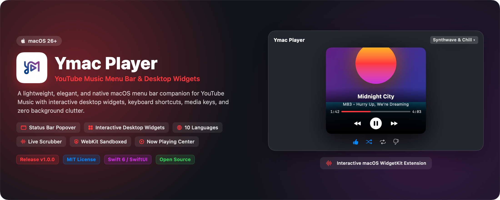
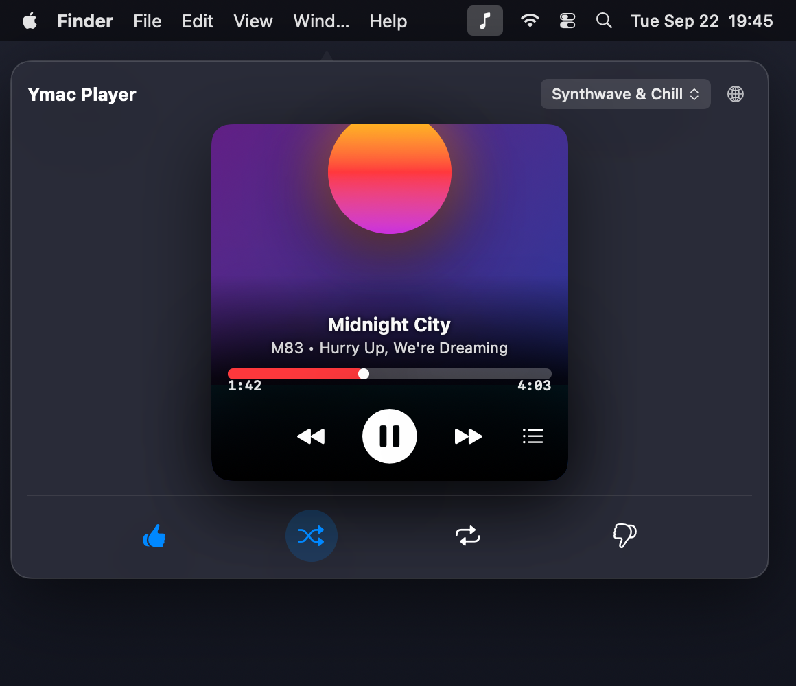
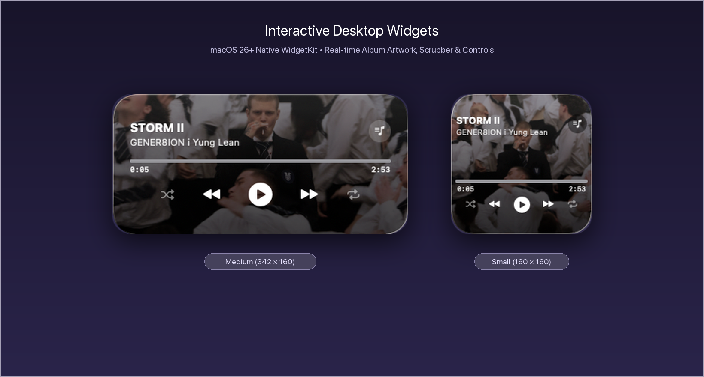
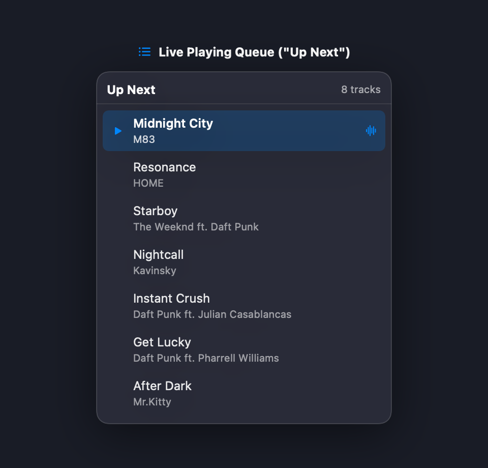
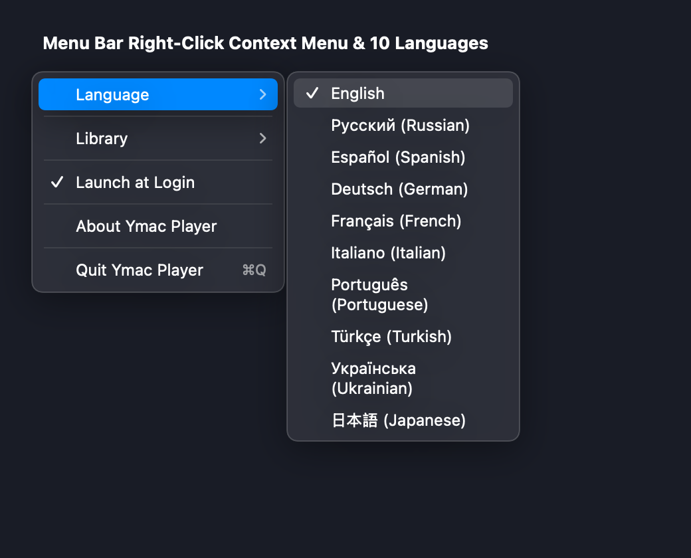
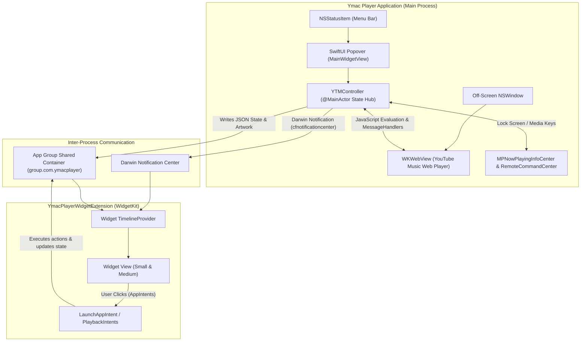

<div align="center">



# Ymac Player 🎵
### *Minimalist YouTube Music Menu Bar Player & Desktop Widgets for macOS*

[](https://apple.com/macos)
[](https://swift.org)
[](https://developer.apple.com/xcode)
[](LICENSE)
[](https://github.com/vbazavluk/YmacPlayer/releases)
[](https://github.com/vbazavluk/YmacPlayer)

<p align="center">
  <a href="#-key-features">Key Features</a> •
  <a href="#-visual-showcase">Visual Showcase</a> •
  <a href="#-installation">Installation</a> •
  <a href="#-interactive-desktop-widgets">Desktop Widgets</a> •
  <a href="#-building-from-source">Building from Source</a> •
  <a href="#-code-signing--troubleshooting">Code Signing</a> •
  <a href="#-architecture">Architecture</a>
</p>

</div>

---

## 💡 Why Ymac Player?

Most desktop music players for YouTube Music are heavy Electron-based wrappers that consume hundreds of megabytes of RAM, drain battery life, and clutter the Dock.

**Ymac Player is different:**
- 🏎 **Native Swift & SwiftUI:** Instant response times and minimal CPU/memory footprint (~50MB RAM vs 600MB+ in Electron).
- 📍 **Unobtrusive Menu Bar Resident:** Lives exclusively in your macOS menu bar without taking up Dock space or cluttering your command-tab switcher.
- 🧩 **Interactive Desktop Widgets:** Native macOS 26+ desktop widgets powered by `AppIntents` — control playback and change playlists right from your wallpaper without switching apps.
- 🎧 **Full System Media Integration:** Native keyboard media keys (F7, F8, F9), macOS Control Center, Touch Bar, and Lock Screen support via `MPNowPlayingInfoCenter`.
- 🔒 **Zero Telemetry & WebKit Sandboxed:** Your credentials stay securely inside Apple's native WebKit container with no third-party tracking or middleman servers.

---

## 📸 Visual Showcase

### 1. Menu Bar Popover Player
Click the menu bar icon to reveal an album artwork card with live scrubbing, track metadata, queue access, playlist selector, and reaction controls.

<div align="center">
  
</div>

<br/>

### 2. Interactive Desktop Widgets (`systemMedium` & `systemSmall`)
macOS 26+ interactive widgets placed directly on your desktop or Notification Center. Tap buttons to toggle playback, skip tracks, and browse your favorite playlists without opening any app windows.

<div align="center">
  
</div>

<br/>

### 3. Live "Up Next" Playing Queue
View upcoming songs in your queue and jump directly to any song with a single click.

<div align="center">
  
</div>

<br/>

### 4. Right-Click Context Menu & 10 Built-in Languages
Right-click the menu bar icon to change the language instantly, navigate library categories (Playlists, Albums, Artists), toggle launch at login, or quit.

<div align="center">
  
</div>

---

## ✨ Key Features

| Feature | Description |
| :--- | :--- |
| 📍 **Status Bar Player** | High-resolution album artwork, seekable progress slider, track title, artist info, and full playback controls in an elegant popover. |
| 🎛 **Interactive Widgets** | macOS 26+ desktop widgets in `systemSmall` and `systemMedium` sizes utilizing `AppIntents` for instant zero-window clicks. |
| 📚 **Quick Playlist Switcher** | Switch between playlists and mixes directly from the player popover or the desktop widget without opening the browser. |
| 📜 **Up Next Queue** | Real-time queue inspector popover with live active track indicator and scroll-to-current navigation. |
| 🎧 **System Media Integration** | Deep integration with `MPNowPlayingInfoCenter` and `MPRemoteCommandCenter`. Full support for keyboard media keys, macOS Control Center, and Lock Screen. |
| ⚡️ **Persistent Audio Pipeline** | Invisible container background window prevents macOS App Nap from suspending music when the popover is dismissed. |
| 🌐 **10 Localized Languages** | Dynamic UI localization: English, Deutsch, Українська, Русский, Español, Português, Italiano, Français, Română, and Polski. |
| 🚀 **Launch at Login** | Native macOS autostart support via Apple's modern `SMAppService` framework. |
| 👍 **Like / Dislike / Shuffle / Repeat** | Full reaction controls: thumbs up, thumbs down, shuffle, and cycle repeat modes (Off, All, One). |

---

## 📥 Installation

> [!IMPORTANT]
> ### 🛡️ Running Open-Source macOS Apps (No Apple Developer ID)
> Ymac Player is a 100% free, community-driven open-source project. Because we do not pay for Apple's \$99/year Developer Program, the releases are distributed as ad-hoc signed open-source binaries.
> 
> When you first open the app, macOS Gatekeeper will protect you by blocking untrusted downloads with an alert:  
> *"Ymac Player is damaged and can't be opened. You should move it to the Trash"* or *"Apple cannot check it for malicious software"*.
> 
> **To launch the app, simply remove the quarantine attribute:**
> 
> ```bash
> xattr -cr /Applications/YmacPlayer.app
> ```
> 
> *Alternatively, via Finder:*
> 1. In Finder, open `/Applications`.
> 2. **Right-click** (or `Control` + click) `YmacPlayer.app` and select **Open**.
> 3. Click **Open** in the dialog. macOS will remember your approval and will never ask again.

### Steps to Install:
1. Download **`YmacPlayer-1.0.0.dmg`** (or `YmacPlayer-1.0.0.zip`) from [Releases](https://github.com/vbazavluk/YmacPlayer/releases).
2. Open the `.dmg` and drag **Ymac Player.app** into `/Applications`.
3. Run `xattr -cr /Applications/YmacPlayer.app` (or Right-click > Open).
4. Click the music note icon in your menu bar, click **Login**, and sign into YouTube Music!

---

## 🧩 Interactive Desktop Widgets Setup

To add Ymac Player widgets to your macOS 26+ desktop or Notification Center:

1. **Start the app:** Ensure Ymac Player is running and logged in.
2. **Open Widget Gallery:**
   - Right-click an empty area on your macOS desktop and select **Edit Widgets...**
   - *OR* Click the date/time in the top right to open Notification Center, then scroll down and click **Edit Widgets**.
3. **Select Ymac Player:** Search for **Ymac Player** in the left sidebar.
4. **Choose Size:**
   - **Small (`systemSmall`):** Compact square widget with artwork, current track, progress bar, and playback controls.
   - **Medium (`systemMedium`):** Wide widget with high-res artwork backdrop, animated waveform badge, playlist switcher, live time scrubber, and extended controls.
5. **Drag to Desktop:** Drag your desired widget to any position on your desktop or Notification Center.

---

## 🛠 Building from Source

### Prerequisites
- macOS 26.0 or later.
- Xcode 26.0 or later (with macOS SDK).
- Apple Developer account (free personal Apple ID or paid developer program).

### 1. Clone the Repository
```bash
git clone https://github.com/vbazavluk/YmacPlayer.git
cd YmacPlayer
```

### 2. Build via Xcode GUI
1. Double-click `YmacPlayer.xcodeproj` to open the project in Xcode.
2. Select the **YmacPlayer** scheme and your Mac as the destination.
3. In **Signing & Capabilities** for both `YmacPlayer` and `YmacPlayerWidgetExtension`:
   - Select your personal or organization Apple **Team**.
   - Ensure the Bundle Identifier is unique (e.g. `com.yourname.YmacPlayer`).
4. Press **⌘B** to build or **⌘R** to run.

### 3. Build via Command Line (Release Automation)
We provide an automated release script that compiles the Release configuration, generates a drag-and-drop `.dmg`, a `.zip` archive, and SHA-256 checksums:

```bash
# Build release packages in dist/
./scripts/build_release.sh
```

Artifacts will be output to `./dist/`:
```
dist/
├── YmacPlayer-1.0.0.dmg
├── YmacPlayer-1.0.0.zip
└── SHA256SUMS.txt
```

---

## 🔐 Code Signing & Troubleshooting Guide

### Personal Apple Developer Account (7-Day Expiration)
If you sign the application using a free personal Apple ID (`Apple Development: your_email@example.com`):
- Apple provisions personal development profiles with a **7-day lifespan** (`TimeToLive = 7`).
- After 7 days, macOS AMFI (*Apple Mobile File Integrity*) will terminate the app on launch with error code `137 (SIGKILL)` or `Launchd job spawn failed: 4`.
- **How to refresh:** Simply open the project in Xcode and press **⌘R** to rebuild and install a fresh profile, or purchase an Apple Developer Program membership for yearly signing certificates.

### App Groups & Entitlements
Ymac Player uses an App Group (`group.com.ymacplayer`) to share playback state between the menu bar application and the Widget Extension:
- Both `YmacPlayer.entitlements` and `YmacPlayerWidgetExtension.entitlements` must include the matching `com.apple.security.application-groups` entitlement.
- The Widget Extension requires `com.apple.security.app-sandbox` set to `YES`.

### Ad-Hoc Local Builds
To run a self-compiled binary locally without an Apple Developer ID certificate:
```bash
codesign --force --deep --sign - /Applications/YmacPlayer.app
```

---

## 🌐 Supported Languages

Ymac Player features native localization across 10 languages:

| Locale Code | Language | Native Name |
| :---: | :--- | :--- |
| `en` | English | English |
| `de` | German | Deutsch |
| `ru` | Russian | Русский |
| `uk` | Ukrainian | Українська |
| `es` | Spanish | Español |
| `pt` | Portuguese | Português |
| `it` | Italian | Italiano |
| `fr` | French | Français |
| `ro` | Romanian | Română |
| `pl` | Polish | Polski |

Switch languages at any time with one click from the right-click menu bar menu.

---

## 🏛 Architecture & How It Works



### Key Components
1. **`YTMController`:** The single-source-of-truth `@MainActor` observable controller that manages player state, timing intervals, track queues, playlist lists, and IPC synchronization.
2. **Injected JavaScript Bridge (`syncScript`):** Periodically queries the YouTube Music web DOM for track metadata, album artwork URLs, playback time, duration, and queue contents, and forwards playback commands (`play()`, `pause()`, `next()`, `previous()`, `setVolume()`, `seekTo()`).
3. **Persistent Audio Window:** `HiddenWebView` is mounted inside an invisible `NSWindow` with `isReleasedWhenClosed = false`. This guarantees YouTube Music Web audio playback continues uninterrupted when the user closes the status bar popover.
4. **App Group & Darwin Notifications:** The main app and widget extension exchange playback state via shared App Group `UserDefaults` and file storage (`artwork.png`), notifying each other instantly using low-overhead Darwin notifications (`CFNotificationCenterGetDarwinNotifyCenter`).

---

## 🤝 Contributing

Contributions are warmly welcomed! To contribute:

1. Fork the repository on GitHub.
2. Create a feature branch: `git checkout -b feature/my-new-feature`.
3. Commit your changes: `git commit -m 'Add some feature'`.
4. Push to the branch: `git push origin feature/my-new-feature`.
5. Open a Pull Request using the provided [Pull Request Template](.github/PULL_REQUEST_TEMPLATE.md).

---

## 📄 License

This project is licensed under the **MIT License** — see the [LICENSE](LICENSE) file for details.

---

## ⚠️ Disclaimer

*Ymac Player is an independent open-source project and is not affiliated with, sponsored by, or endorsed by Google LLC, YouTube, or Apple Inc. YouTube Music and Apple are registered trademarks of their respective owners.*
